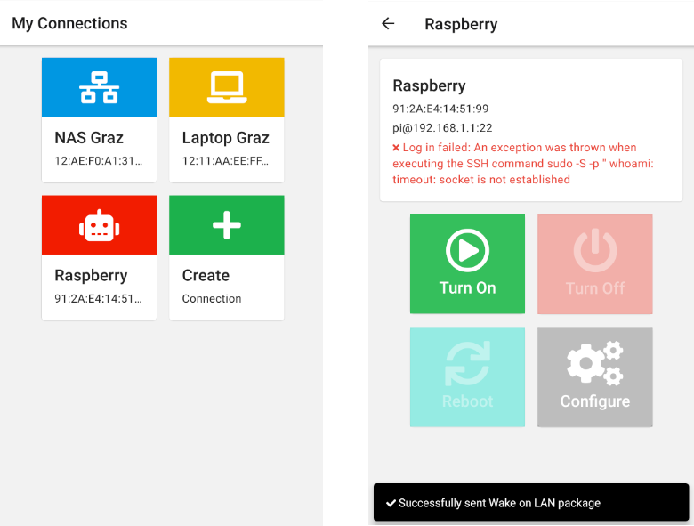
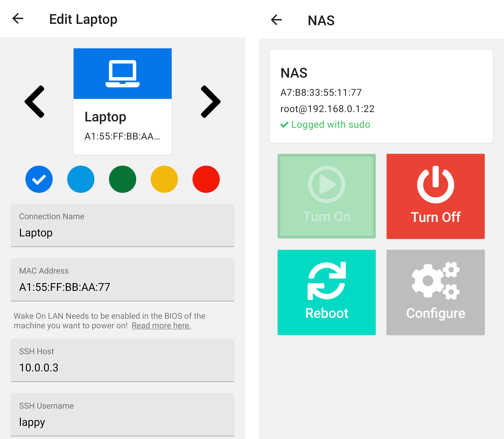

# BootBoi
Ever wanted to turn on your remote machine (laptop, Raspberry, NAS), but didn't want to leave the couch? Well I for sure
understand this problem to the heart. But fear no more, as BootBoi is here to save you from the gruesome task of standing up 
and pushing a button.

BootBoi features **remote power on / power off / reboot** for as many remote machines as you can imagine with the 
combined power of `ssh` and `Wake On Lan`.

## Preparing your Remote Machine
- Before you can use BootBoi with your remote machines, you have to prepare them for **remote** rebooting and powering them on/off. 
### Power On
- To power a remote device on, BootBoi uses [Wake On Lan](https://en.wikipedia.org/wiki/Wake-on-LAN).
- This needs to be enabled in the BIOS of the machine you want to power on, read more [here](https://www.lifewire.com/wake-on-lan-4149800).

### Power Off / Reboot
- BootBoi uses [SSH](https://simple.wikipedia.org/wiki/Secure_Shell) to execute `whoami`, `poweroff` and `reboot` on the remote
machine. 
- So make sure that
  1. Those binaries are available and in `$PATH`
  2. The SSH user has `sudo` access to `whoami`, `poweroff` and `reboot`
      - Either by allowing the user sudo access only to those binaries via the [sudoers file](https://linux.die.net/man/5/sudoers) (recommended)
          - E.g. `echo "my_ssh_user ALL=(ALL) /sbin/reboot,/sbin/poweroff,/usr/bin/whoami" >> /etc/local/sudoers` 
      - Or by using `root` as SSH user in BootBoi
    
## Release
### Google Play
- Setup gradle and keystore for release: Follow https://reactnative.dev/docs/signed-apk-android
- `cd android` and `./gradlew bundleRelease`
- Change `BOOTBOI_UPLOAD_STORE_PASSWORD` and `BOOTBOI_UPLOAD_KEY_PASSWORD` in `android/gradle.properties` accordingly
- To test the release, run `npx react-native run-android --variant=release`, it will create a release apk to `android/app/build/outputs/apk/release/app-release.apk`

## Development
### Remote Communication Module
- BootBoi uses this [Remote Communication Module](https://github.com/BootBoi/remote-communication) to use Java APIs for
  rebooting and powering on/off.

### Environment
- `yarn start` to start the development server
  - reload with `r`
- `yarn android` to build the android app (dev server needs to be running), only needed when 
dependencies in package.json or native source changes
- If you get `Could not initialize class org.codehaus.groovy.reflection.ReflectionCache`: Need to lower JDK version (tested with JDK 11)
